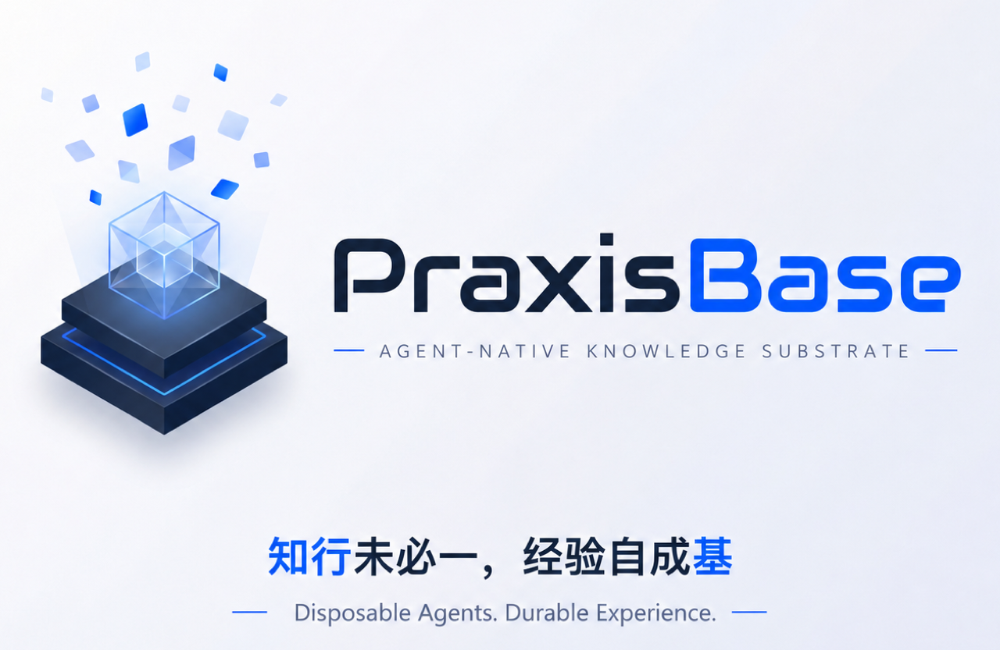

<p align="center">
  
</p>

# PraxisBase — Agent-Native Knowledge Substrate

**Languages:** English | [简体中文](README.zh-CN.md)

> **AGENT-NATIVE KNOWLEDGE SUBSTRATE**
>
> **Disposable Agents. Durable Experience.**
>
> 中文：**知行未必一，经验自成基。**

PraxisBase is an agent-native knowledge substrate for people and teams running many temporary and persistent agents. It keeps the agents disposable while making their experience durable: knowledge, repair memory, reusable skills, decisions, and preferences.

The project started from the LLM Wiki idea, but its current direction is broader: **agents are cattle, knowledge is the herd memory**. Codex, Claude Code, OpenCode, Hermes, OpenHuman, OpenClaw, temporary repair agents, and future MCP clients should all be replaceable peers that read and write the same durable experience layer through a common CLI and file protocol.

## Core Philosophy

Modern agent systems should not depend on one precious long-lived container or one hand-tended agent session. Inspired by Anthropic's Managed Agents architecture, PraxisBase separates:

- **Brains**: temporary or persistent agent loops that reason and decide
- **Hands**: sandboxes, tools, shells, OpenClaw environments, K8s systems
- **Memory**: durable episodes, proposals, reviews, skills, known fixes, procedures, and bundles

Anthropic decouples session, harness, and sandbox so failed harnesses or sandboxes can be replaced. PraxisBase applies the same philosophy to organizational learning: an agent can disappear after one repair run, but its useful experience can survive, be reviewed, be promoted, and become part of the next agent's context.

One important long-term capability is **skill synthesis**: repeated successful episodes should be summarized into reusable `SKILL.md` files, reviewed by AI, promoted into the shared skill registry, and loaded by later agents. The same loop should work for personal memories, project-local lessons, team knowledge, and organization-level policies.

## What It Does

```text
Codex / Claude Code / OpenCode / Hermes / OpenHuman / OpenClaw / K8s / Feishu
          |
          v
  temporary and persistent agent peers
          |
          v
    PraxisBase file protocol + CLI
          |
          v
  Git-backed durable knowledge layer
          |
          v
 static repair bundles + HTML inspection
          |
          v
       next agent starts smarter
```

## Phase 1 MVP

The first MVP targets **OpenClaw sandbox auto-repair**:

- `praxisbase init` creates the agent knowledge substrate skeleton
- `praxisbase repair-context openclaw --logs ...` returns a compact repair bundle
- agents submit repair `episode` records after each run
- agents submit `proposal` records when they discover reusable knowledge
- skill improvements can enter the same proposal/review/promotion lane
- AI reviewer agents classify risk and approve routine changes
- `praxisbase promote --auto` promotes approved proposals into stable knowledge
- `praxisbase build` generates repair bundles, indexes, `llms.txt`, and HTML inspection output
- GitLab Scheduled Pipelines run review, promotion, and build jobs

MVP intentionally does **not** implement MCP server, Hermes runner, K8s runtime integration, external search, vector DB, blockchain, or a central master agent.

## Knowledge Model

PraxisBase stores different knowledge lifecycles in different places:

| Layer | Carrier | Examples |
| --- | --- | --- |
| Protocol state | `.praxisbase/` | inbox episodes, proposals, reviews, policies, schedules |
| Stable knowledge | `kb/` | known fixes, procedures, decisions, notes, reviewed memory |
| Agent skills | `skills/` | OpenClaw repair skills, K8s triage skills |
| Distribution | `dist/` | repair bundles, indexes, HTML, `llms.txt` |
| Raw evidence | external systems | full logs, tickets, Feishu exports, object storage |

Large raw logs stay outside Git. Git stores references, summaries, hashes, and redacted evidence.

Knowledge objects are classified across four dimensions:

| Dimension | Values |
| --- | --- |
| Scope | `personal`, `project`, `team`, `org` |
| Layer | `preference`, `convention`, `technical`, `domain`, `project` |
| Type | `model`, `decision`, `guideline`, `pitfall`, `process`, `known_fix`, `procedure`, `skill`, `policy`, `note` |
| Maturity | `draft`, `verified`, `proven`, `stale`, `archived` |

Adapters should stay thin: hooks capture evidence, watchers support agents without hooks, and scheduled distill jobs turn captures into episodes, proposals, reports, and exceptions.

## Native Memory Bridge

PraxisBase should reuse agent-native memory instead of replacing it. Existing Codex sessions, Hermes skill summaries, OpenHuman persona/preferences, OpenClaw repair records, and generic agent notes can enter as source refs with hashes and redacted summaries.

`memory import` backfills native memory into capture/proposal candidates. `memory refresh` sends reviewed PraxisBase knowledge back as runtime context, install snippets, or patch proposals. It is not silent bidirectional sync: native memory is a source and cache, while reviewed PraxisBase objects remain the shared authority.

## Multi-Agent CLI Flow

The first multi-agent experience layer is CLI-first and proposal-based:

```bash
praxisbase install codex --dry-run --json
praxisbase context get --agent codex --stage diagnosis --query "openclaw auth expired" --json
praxisbase capture finish --agent codex --result success --source-ref raw-vault://codex/session-1 --source-hash sha256:session1 --summary "Fixed a project issue and tests passed." --json
praxisbase capture submit capture.json --json
praxisbase memory import --agent hermes --source hermes-memory.json --json
praxisbase memory refresh --agent hermes --target instruction-snippet --source-refs kb/known-fixes/openclaw-auth-expired.md --json
praxisbase distill run --json
praxisbase watch --agent claude-code --workspace . --once --json
```

These commands write only protocol state under `.praxisbase/` and proposal candidates under `.praxisbase/inbox/proposals/`. Stable `kb/` and `skills/` changes still go through review and promotion.

### Example: Hermes Skill Evolution

Hermes already has agent-managed skills, persistent memory, and curator-style skill maintenance. PraxisBase can reuse those outputs as proposal sources and send reviewed shared skills back as context or patch proposals.

Hermes is an accelerator, not a dependency: Codex, Claude Code, OpenCode, OpenHuman, OpenClaw, and generic agents must still work through the same CLI/file protocol.

## Why This Exists

Teams that operate many agent sandboxes have a different problem from ordinary documentation:

- a repair agent may live for minutes
- a sandbox may be deleted after use
- a persistent bot may be upgraded or replaced
- model and harness assumptions will change
- the useful repair experience must survive all of that

PraxisBase makes the durable part explicit. It is the shared memory, skill registry, review lane, skill synthesis lane, and repair bundle generator for disposable agents.

## Current Documents

- [Deployment Guide](docs/deployment.md)
- [Agent Knowledge Substrate Design](docs/superpowers/specs/2026-05-17-agent-knowledge-substrate-design.md)
- [Multi-Agent Experience Layer Design](docs/superpowers/specs/2026-05-19-multi-agent-experience-layer-design.md)
- [Multi-Agent Experience Layer Implementation Plan](docs/superpowers/plans/2026-05-19-multi-agent-experience-layer-implementation-plan.md)
- [Multi-Agent Experience Layer OpenSpec](docs/openspec/changes/multi-agent-experience-layer/proposal.md)
- [Multi-Agent Experience Layer BDD](docs/bdd/multi-agent-experience-layer.feature)
- [SRE-autopilot K8s Incident Integration Design](docs/superpowers/specs/2026-05-18-sre-autopilot-k8s-incident-integration-design.md)
- [OpenClaw Repair MVP Implementation Plan](docs/superpowers/plans/2026-05-17-openclaw-repair-mvp-implementation-plan.md)
- [OpenSpec Change](docs/openspec/changes/openclaw-repair-mvp/proposal.md)
- [BDD Acceptance Feature](docs/bdd/openclaw-repair-mvp.feature)
- [SRE-autopilot K8s Incident OpenSpec](docs/openspec/changes/sre-autopilot-k8s-incident-integration/proposal.md)
- [SRE-autopilot K8s Incident BDD](docs/bdd/sre-autopilot-k8s-incident-integration.feature)

## Roadmap

- **Phase 0**: Reframe PraxisBase from self-updating wiki to agent knowledge substrate
- **Phase 1**: OpenClaw repair closed loop with file protocol, CLI, AI review, promotion, and static bundles
- **Phase 2**: K8s incident ingest, Feishu workflows, and Hermes-like automatic skill synthesis
- **Phase 3**: Multi-agent CLI adapters and native memory bridge for Codex, Claude Code, OpenCode, OpenClaw, Hermes, OpenHuman, and generic agents
- **Phase 4**: Multi-repo federation, external search backends, stronger provenance, and cross-team synchronization

## Name

**PraxisBase** is the English project name. **知行基座** is the Chinese name.

PraxisBase means the durable base where agents turn knowledge into action and action back into reusable knowledge. The English name keeps the infrastructure feel of a shared substrate; the Chinese name preserves "知行", which fits the loop this project cares about most: learn, repair, verify, promote, and reuse.

## References

- [Anthropic: Scaling Managed Agents, Decoupling the brain from the hands](https://www.anthropic.com/engineering/managed-agents)
- [Karpathy LLM Wiki gist v1](https://gist.github.com/karpathy/442a6bf555914893e9891c11519de94f)
- [LLM Wiki v2](https://gist.github.com/rohitg00/2067ab416f7bbe447c1977edaaa681e2)
- [The Unreasonable Effectiveness of HTML](https://x.com/trq212/status/2052809885763747935)
- [Hermes Agent](https://hermes-agent.nousresearch.com/)
- [OpenClaw](https://github.com/openclaw/openclaw)

## License

MIT
